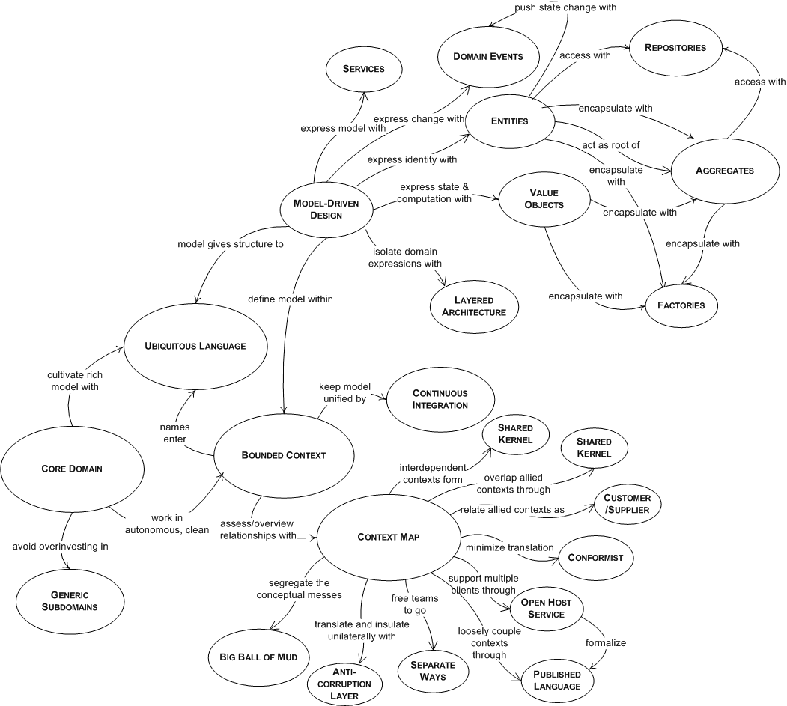
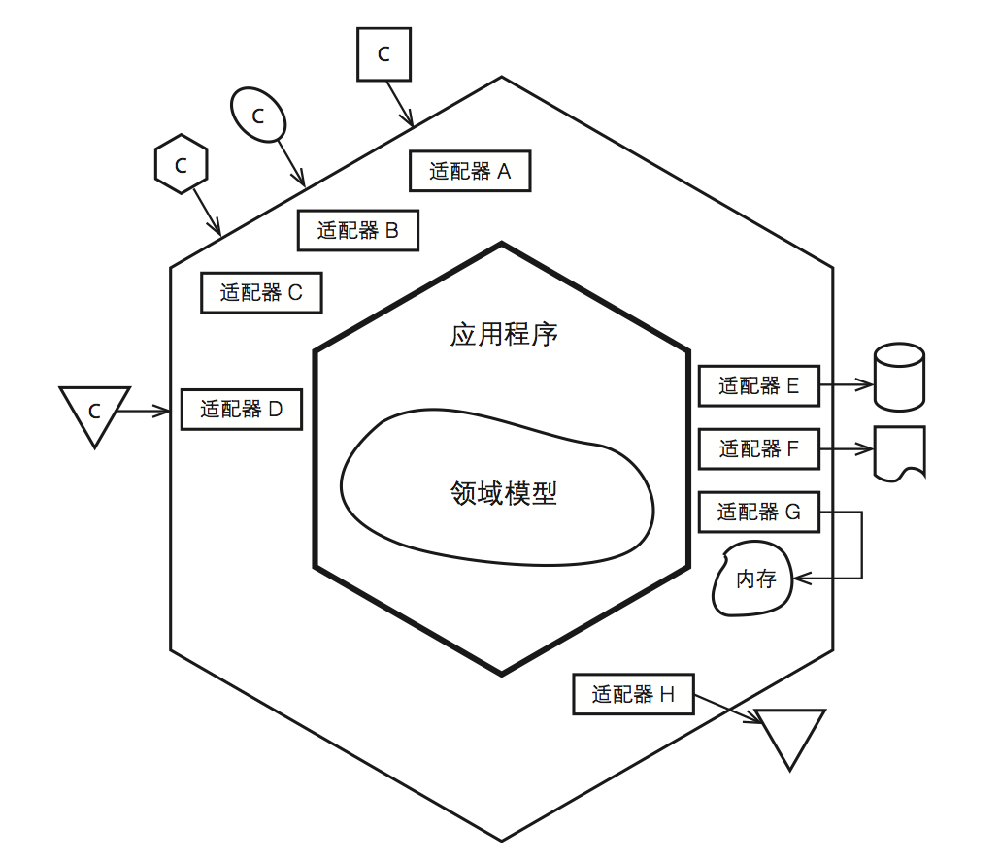

# DDD Learning
[领域驱动设计(DDD)实现之路](http://www.cnblogs.com/davenkin/p/road-to-ddd.html)

## DDD
与其每天钻在那些<del>永远也学不完的技术</del>中，何不将我们的关注点向软件系统所提供的**业务价值**方向思考思考，这也正是DDD所试图解决的问题。

## DDD战略设计
### 领域、子域、核心域

### 限界上下文
一个限界上下文最终可以是一个DLL(.NET)文件或者JAR(Java)文件，甚至可以是一个命名空间（比如Java的package）中的所有对象

* 防腐层: 不同限界上下文件之间 （*上下文映射图*）
	* 负责与外部服务提供方打交道
	* 负责将外部概念翻译成自己的核心领域能够理解的概念

### 通用语言
将一个限界上下文中的所有概念，包括名词、动词和形容词全部集中在一起，我们便为该限界上下文创建了一套通用语言。通用语言是一个团队所有成员交流时所使用的语言，业务分析人员、编码人员和测试人员都应该直接通过通用语言进行交流。

### 架构风格
* Ports + Adapters
	* 领域模型位于应用程序的核心部分
	* 外界与领域模型的交互都通过应用层完成
	* 应用层中不应该包含有业务逻辑，起协调的作用
		* 业务操作代理给我们的领域模型
		* 事务需求

## DDD战术设计
### 充血模型
行为饱满的领域对象

> Reference: 
> > * 函数式编程(Lambada): 帮助我们编写更加具有**业务表达力**的代码
> > * DSL: 实现领域模型

 
### 实体 值对象
* 有ID | 无ID
* mutable | immutable

### 聚合
* 聚合是持久化的基本单位
	* 它和资源库具有一一对应

* DDD的一个重要原则便是：
	* 一次事务只能更新一个聚合实例

* 一次业务操作涉及到了对多个聚合状态的更改
	* 采用**发布领域事件**的方式通知相应的聚合。
	* 此时的数据一致性便从*事务一致性*变成了**最终一致性**（Eventual Consistency）。
	* 领域事件：名+动过去分词 （OrderSubmitted）
 
### 资源库
### 领域服务

## Reference
* [Domain Driven Desgin - wiki](https://en.wikipedia.org/wiki/Domain-driven_design)
